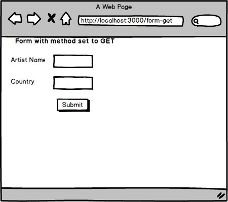

# Posting Data To The Server With A Form


## Skills

- Can create a form that does an HTTP `GET` request
- Can create a form that does an HTTP `POST` request
- Can describe the difference between HTTP query params and HTTP body params
- Can describe the difference between a relative and absolute HTTP URL path
- Can describe an HTTP redirect

## Search Terms

```
html forms
express form handling
html forms method get post
how to parse a body of a request express
```

## Suggested Resources

### Reading

- https://www.w3schools.com/html/html_forms.asp
- https://www.hacksparrow.com/form-handling-processing-in-express-js.html

### Watching

- https://www.youtube.com/watch?v=rin7gb9kdpk
- https://www.youtube.com/watch?v=vKlybue_yMQ

### Lectures

- [Trevor's Lecture on "Posting Data To The Server With A Form"](https://www.youtube.com/watch?v=DzSwBuMfo0g)

## Exercises

### Part 1

- Complete the following sections in the `Express Basics` course in [TeamTreeHouse](https://teamtreehouse.com/library/express-basics)
  - Using Templates with Express

### Part 2

Build a basic web app using Express which can send data to the server via an HTML `<form>` element. You will be required to create two simple pages on the app. The mockups are provided below (notice that while the forms are nearly identical, they have two distinct differences, the URL, and the method attached to the form). When this is completed you should be able to navigate to both URLs and see the same form, but the form at the URL `'/form-get'` should use a `GET` method, while the form that is rendered at the URL `'/form-post'` should use a `POST` method. You could achieve this by creating two seperate views, or for an extra challenge, create one view, that depending on which URL you navigate to, dynamically sets the method of the form as appropriate. 

#### Form Get Page

The `action` property of the form should be set to `/submit-form`



#### Form Post Page

The `action` property of the form should be set to `/submit-form`


#### Server Routes

The server should have the following routes:
1. A route to render the `/form-get` page
    - url: `/form-get`
    - http method: `GET`
    - response: renders the `<form>` with its method set to `GET`, and its `action` set to `/submit-form`.
2. A route to render the `/form-post` page
    - url: `/form-post`
    - http method: `GET`
    - response: renders the `<form>` with its method set to `POST`,  and its `action` set to `/submit-form`
3. A route which handles the form submissions
    - url: `/submit-form`
    - http method: `ANY`
    - response: returns a JSON response of the request's body params and the request's query params
    - example response: `{"body-params": {"artist": "bonobo", "country": "uk"}, "query-params": {}}`


